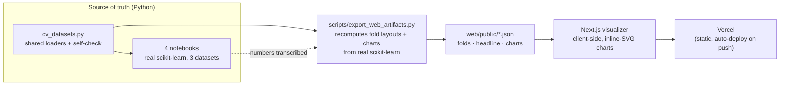

# All About Cross-Validation

> A from-first-principles tour of how to **honestly measure** a machine-learning model —
> four deeply-explained notebooks on real datasets, plus an interactive browser visualizer
> of the fold layouts and the leakage traps that quietly manufacture fake scores.

[](https://github.com/shiva-shivanibokka/All-About-Cross-Validation/actions/workflows/ci.yml)
[](https://cross-validation-visualizer.vercel.app)
[](LICENSE)
[](requirements.txt)
[](requirements.txt)
[](web/package.json)
[](https://cross-validation-visualizer.vercel.app)

**▶ Live visualizer: https://cross-validation-visualizer.vercel.app**

---

## 🧭 Recruiter TL;DR

- **What it is:** an end-to-end teaching project on cross-validation — four notebooks that go
  from *"why training accuracy lies"* to **nested cross-validation**, paired with a deployed
  **Next.js visualizer** that renders the real scikit-learn fold layouts and leakage results in
  the browser.
- **The hardest part:** making the lessons *provable, not asserted*. Every claim is a number
  computed live with scikit-learn on a real dataset, then piped through a small export step into
  a dependency-free browser app — so the notebooks are the single source of truth and the site
  can't quietly disagree with them.
- **The payoff, in real numbers:** the wrong validation doesn't just add noise, it **lies** —
  **0.82 accuracy conjured from 100% random noise**, an **R² of 0.91 that collapses to −0.57** on
  unseen patients, and a **fake +0.15 R²** bought purely by shuffling time. All reproduced
  end-to-end with **zero notebook execution errors**.

---

## Why this exists

"Cross-validation" is usually taught as one line of code — `cross_val_score(model, X, y)` — and
then forgotten. But *which* split you choose is the difference between a number you can trust and a
number that will embarrass you in production. Picking the wrong one doesn't make your metric
noisier; it makes it **confidently wrong**.

This project is the resource I wanted when learning that: a beginner-followable but
practitioner-correct walk through **every cross-validation family a working ML engineer needs**,
where each concept is demonstrated on a real dataset whose *structure forces that family to exist* —
and then made tangible with an interactive visualizer. It's built as an educational deep-dive that
also stands as a portfolio piece: correctness, reproducibility, and a shipped front-end.

---

## The thesis, proven with real numbers

Each result below is one model evaluated two ways; **only the cross-validation strategy changed.**
The numbers come straight from the notebooks (and drive the live visualizer).

| Trap | Wrong way | Honest way | Where |
|------|-----------|------------|-------|
| **Leakage from feature selection** | **0.82** accuracy | **0.49** accuracy (≈ chance) | NB01 · pure-noise data |
| **Group leakage** (patient recurs) | **R² 0.91** / MAE 2.4 | **R² −0.57** / MAE 10.8 | NB03 · Parkinsons |
| **Time leakage** (shuffled series) | **R² 0.947** | **R² 0.802** (a fake **+0.15**) | NB03 · Bike Sharing |
| **Selection bias** (`best_score_`) | **0.795** | **0.790 ± 0.019** nested | NB04 · German Credit |

- The **0.82 from noise** uses a target that is *independent of every one of 10,000 columns* — the
  "skill" is entirely leaked by running feature selection before the split instead of inside a
  `Pipeline`.
- The **R² 0.91 → −0.57** on Parkinsons voice data means the "great" model is actually **worse than
  predicting the mean** (baseline MAE 8.7) on a patient it has never heard — a random split just let
  it recognize the *person*, not the disease.
- The **nested-CV gap** is small here (+0.005) *by design* — the point is that `best_score_` is a
  selection score, biased upward in expectation, and nested CV is the honest estimate.

---

## The notebooks

Each notebook opens in plain English, comments every line, and explains every chart with a
**"How to Read This Chart"** aside. Beginner-followable; practitioner-correct.

| # | Notebook | What it covers | Data |
|---|----------|----------------|------|
| 01 | [Foundations & the Leakage Trap](01_foundations_and_leakage.ipynb) | training-error vs holdout, the single-split lottery, **leakage** (Pipeline-in-fold, 0.82 accuracy from noise), choosing K | German Credit |
| 02 | [The K-Fold Family](02_the_kfold_family.ipynb) | `KFold`, `StratifiedKFold`, `RepeatedStratifiedKFold`, `ShuffleSplit`, **LOOCV / Leave-P-Out**, `cross_val_predict` (out-of-fold), **regression CV** | Credit + Bike |
| 03 | [Grouped & Time-Aware CV](03_grouped_and_time_aware.ipynb) | `GroupKFold`, `StratifiedGroupKFold`, `LeaveOneGroupOut`, `TimeSeriesSplit` (expanding vs sliding), **purged & embargoed CV** | Parkinsons + Bike |
| 04 | [Model Selection with CV](04_model_selection.ipynb) | Grid, Random, **Successive Halving**, Bayesian (**GP** via scikit-optimize + **TPE** via Optuna), and **nested cross-validation** | German Credit |

---

## Datasets — all real, none toy

Chosen so each one's *structure forces a CV family to exist*. Loaders live in
[`cv_datasets.py`](cv_datasets.py); everything is fetched at runtime (OpenML / UCI) and cached
locally under `~/scikit_learn_data` — nothing is committed.

| Dataset | Size | Why it's here |
|---------|------|---------------|
| **German Credit** | 1,000 × 20 | Small + imbalanced (30% "bad") → CV matters most when data is scarce. |
| **Bike Sharing** | 17,379 hourly | A true time order + regression target → time-aware CV, regression CV. |
| **Parkinsons Telemonitoring** | 5,875 × 18, **42 patients** | ~139 recordings per patient → the dramatic group-leakage story. |

Run `python cv_datasets.py` to fetch all three and print a self-check.

---

## The interactive visualizer (`web/`)

A **Next.js** app (100% client-side, no backend, no data leaves your machine) that reads small JSON
artifacts exported from the notebooks. All charts are **hand-rolled inline SVG — no charting
library.** Seven tabs, each with a "How to read this" explainer:

- **Fold Explorer** — real scikit-learn fold membership for KFold / Stratified / Group / TimeSeries
  / Purged, on a demo strip you can eyeball column by column.
- **Leakage** — the honest-vs-leaky bars *plus* a line chart showing the lie grow as you offer more
  noise features.
- **Group Leakage** — the R² collapse, a per-patient error strip plot (the long tail GroupKFold
  exposes), and a predicted-vs-actual scatter for one held-out patient.
- **Time Leakage** — the fake +0.15 R² from shuffling a time series.
- **Nested CV** — `best_score_` vs the honest nested estimate.
- **Out-of-Fold** — a `cross_val_predict` ROC curve (AUC 0.792) and confusion matrix on German Credit.
- **About** — the whole series in plain language.

---

## Architecture

The notebooks are the **single source of truth**: every number is computed there with real
scikit-learn. A thin export step turns that output into small static JSON, which a purely
client-side app renders — so there is **no backend, no inference server, and no way for the site to
drift from the notebooks** (regenerate the artifacts and the site updates).



**Why this shape?** A teaching tool has to be *trustworthy* first. Alternatives like re-running
models in the browser (heavy, non-reproducible) or hard-coding chart data by hand (drifts silently)
were rejected in favor of a reproducible export: `export_web_artifacts.py` recomputes the fold
layouts and detailed charts directly from scikit-learn, and the four headline comparison numbers are
transcribed from the notebooks as documented constants. Keeping the app 100% client-side means it
deploys as static files, costs nothing to run, and keeps every computation on the visitor's machine.

---

## Tech stack

| Layer | Tools | Notes |
|-------|-------|-------|
| **ML / data** | scikit-learn ≥1.5, pandas, numpy, scipy | fold splitters, pipelines, `cross_val_predict`, metrics |
| **Hyperparameter search** | Optuna (TPE), scikit-optimize (GP), sklearn Halving | four search strategies compared under nested CV |
| **Plotting (notebooks)** | matplotlib, seaborn | every figure has a "How to Read This Chart" aside |
| **Data export** | Python stdlib + scikit-learn | `scripts/export_web_artifacts.py` → static JSON |
| **Web** | Next.js 15, React 19, TypeScript | App Router, 100% client-side |
| **Charts** | hand-written inline SVG | no charting dependency; theme-aware CSS |
| **Deploy** | Vercel | static hosting, auto-deploy on `git push` |

---

## Skills demonstrated

Same facts as above, in the language a skim-reading reviewer scans for:

- **ML evaluation methodology** — cross-validation family selection, data-leakage diagnosis,
  out-of-fold prediction, and **nested cross-validation** to avoid selection bias.
- **Reproducible experimentation** — seeded, deterministic notebooks that execute end-to-end with
  zero errors; results verified against the artifacts that drive the UI.
- **Data pipeline design** — shared, cached dataset loaders and an export step that turns raw model
  output into a typed artifact contract consumed by the front-end.
- **System design & architecture** — an explicit, documented tradeoff (notebooks as source of truth →
  JSON artifacts → client-side render) chosen for trustworthiness and zero-cost hosting.
- **Front-end engineering & data visualization** — a TypeScript/Next.js app with custom,
  dependency-free SVG charts (line, strip, scatter, ROC, confusion matrix, fold heatmap).
- **Cloud deployment** — shipped and live on **Vercel**, auto-deploying from `main`.

---

## Getting started

### Notebooks

```bash
pip install -r requirements.txt
python cv_datasets.py            # fetch + cache the 3 datasets, print a self-check
jupyter notebook 01_foundations_and_leakage.ipynb
```

Each notebook runs top-to-bottom in a few minutes on a laptop (the Bayesian-search section in
notebook 04 is the slowest, ~2 minutes).

### Web visualizer

```bash
python scripts/export_web_artifacts.py   # regenerate web/public/{folds,headline,charts}.json
cd web && npm install && npm run dev      # http://localhost:3000
```

The `.json` artifacts are committed, so `npm run dev` works without the Python step — only re-run
the export if you change a notebook or the export script.

---

## Project structure

```
├── 01_foundations_and_leakage.ipynb   # NB01 — leakage & the single-split lottery
├── 02_the_kfold_family.ipynb          # NB02 — K-Fold family, LOOCV, out-of-fold
├── 03_grouped_and_time_aware.ipynb    # NB03 — group / time / purged CV
├── 04_model_selection.ipynb           # NB04 — search strategies + nested CV
├── cv_datasets.py                     # shared real-dataset loaders (+ runnable self-check)
├── scripts/
│   └── export_web_artifacts.py        # recompute fold layouts + charts → web/public/*.json
├── web/                               # Next.js visualizer (deployed to Vercel)
│   ├── app/                           # pages, components, inline-SVG charts, data types
│   └── public/                        # folds.json · headline.json · charts.json
├── PLAN.md                            # living build plan / design decisions
├── requirements.txt
└── LICENSE
```

---

## Testing

There is **no formal pytest suite** — this is a teaching repo, so correctness is enforced by checks
that run automatically in **CI on every push** ([`.github/workflows/ci.yml`](.github/workflows/ci.yml)):

- **Runnable self-check:** `python cv_datasets.py` asserts the shape, class balance, and group
  invariants of all three datasets (e.g. that Parkinsons really has 42 recurring patients).
- **Executable notebooks:** all four notebooks are executed with
  `jupyter nbconvert --to notebook --execute` and verified to contain **zero error cells** — the
  prose numbers are the live outputs, not stale copy.
- **Drift gate:** CI regenerates the web artifacts and fails if `headline.json` no longer matches the
  notebook-sourced constants — so the visualizer can't silently disagree with the notebooks.
- **Web build:** `tsc --noEmit` + `next build` type-check and compile the app.

The one gap that remains: the checks verify the notebooks *run* and that the headline numbers are in
sync, but they don't assert every intermediate numeric output — a subtly wrong (but non-erroring)
value could still slip through.

---

## Deployment

The visualizer is **live on Vercel**: **https://cross-validation-visualizer.vercel.app**

- Hosted as static output (the app is fully client-side).
- The Vercel project's **Root Directory** is set to `web/`, so a plain `git push` to `main`
  auto-deploys.
- To deploy manually: `vercel --prod` from the repo root (the project's root directory resolves to
  `web/`).

---

## Roadmap / known limitations

**Known limitations (today):**
- The four **headline comparison numbers** in the visualizer are constants transcribed from the
  notebooks (the fold layouts and detailed charts *are* recomputed live by the export script). They
  must be re-synced after a notebook change — CI now enforces this with a drift gate, but the sync
  itself is still manual.
- The **Fold Explorer** uses a 48-sample demo strip for legibility; it illustrates fold *membership*,
  not the full datasets.

**Planned:**
- **Auto-extract the headline numbers** from the executed notebooks so nothing is hand-transcribed,
  removing the drift risk at the source rather than just gating it.
- **More CV methods** — a nested-CV distribution ("winner's curse") visualization, deeper
  purged/embargoed CV, and additional splitters.

---

## Key ideas, one line each

1. **Never score on training rows**, and never let a single split's luck decide your result.
2. **Every data-dependent step goes inside a `Pipeline`** so CV re-fits it per fold — or you leak.
3. **`StratifiedKFold` is the classification default;** repeat it to pin down the mean.
4. **If an entity recurs, split on the entity;** if time flows, never shuffle it.
5. **Tune with CV, but *report* with nested CV** — `best_score_` is a selection score, not a
   generalization estimate.

> **The golden rule beneath all of it:** the data you use to judge a model must be data the model —
> and your choices about it — never touched.

---

## License

MIT — see [LICENSE](LICENSE).
